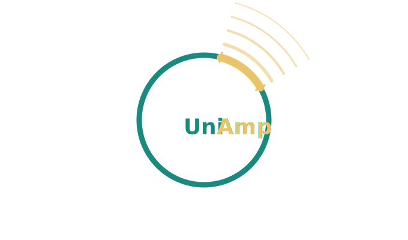

<p align="center">
  
  <h1 align="center">UniAmp</h1>
  <p align="center">A computational pipeline to generate PCR primers specific to a target genome.</p>
</p>

---

## Overview
The UniAmp pipeline can be conceptually split into 4 parts:
1. Build directory of query genomes with high sequence similarity to target genome.
2. Retrieve unique sequences in a target genome compared to query genomes.
3. Select unique target sequence for primer design.
4. Design primers to unique target sequence.

### Visual representation:


---

## Installation
Clone the repository:
```bash
git clone https://github.com/kenscripts/UniAmp.git
```
Run the setup script and specify UniAmp path:
```bash
source <path_to_UniAmp>/UniAmp/setup_uniamp.sh <path_to_UniAmp>
```

## Documentation
Further information, including how to use UniAmp, is available at: https://uniamp.readthedocs.io/en/latest/

## Citation
If you use UniAmp in your research, please cite:

> Acosta, K., Sorrels, S., Chrisler, W., Huang, W., Gilbert, S., Brinkman, T., Michael, T. P., Lebeis, S. L., & Lam, E. (2023). Optimization of Molecular Methods for Detecting Duckweed-Associated Bacteria. *Plants*, 12(4), 872. https://doi.org/10.3390/plants12040872

# Overview
UniAmp (Unique Amplicon) is a computational pipeline to generate PCR primers specific to a target genome.<br>
<br>
The UniAmp pipeline can be conceptually split into 4 parts:
1. Build directory of query genomes with high sequence similarity to target genome.
2. Retrieve unique sequences in a target genome compared to query genomes.
3. Select unique target sequence for primer design.
4. Design primers to unique target sequence.

### Visual representation:


# Installation
Clone the repository:<br>
`git clone https://github.com/kenscripts/UniAmp.git`

Run the setup script and specify UniAmp path:<br>
`source <path_to_UniAmp>/UniAmp/setup_uniamp.sh <path_to_UniAmp>`


# Documentation
Further information, including how to use UniAmp, is available at: https://uniamp.readthedocs.io/en/latest/


# Citation
If you use UniAmp in your research, please cite the following publication:<br>
<br>
Acosta, K., Sorrels, S., Chrisler, W., Huang, W., Gilbert, S., Brinkman, T., Michael, T. P., Lebeis, S. L., & Lam, E. (2023). Optimization of Molecular Methods for Detecting Duckweed-Associated Bacteria. Plants, 12(4), 872. https://doi.org/10.3390/plants12040872
